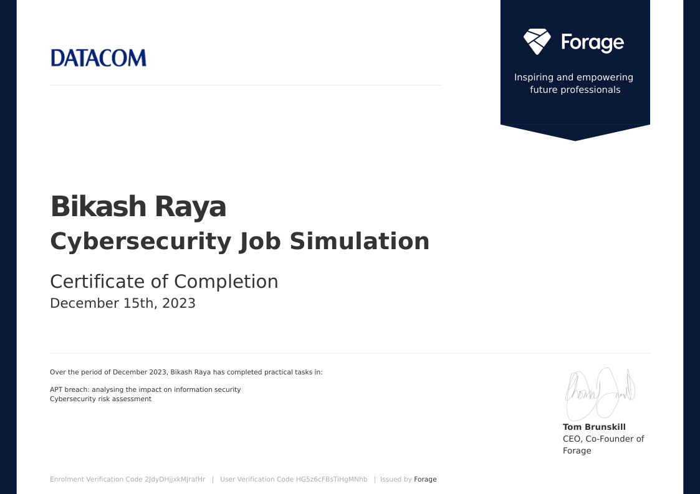

# 💳 Mastercard Cybersecurity Virtual Experience Program

### Forage Virtual Experience Program

---

**Completed by:** Bikash Raya  
**Date:** December 2023

---

## 📋 Overview

This repository documents my completion of the **Datacom Cybersecurity Virtual Experience Program** through Forage. In this simulation, I worked as a **Cybersecurity Consultant** responding to a sophisticated nation-state cyberattack.

### 🎯 Simulation Objectives

| Task | Description | Status |
|------|-------------|--------|
| **Task 1** | APT Breach Analysis - Investigating APT34 (OILRIG) | ✅ Completed |
| **Task 2** | Comprehensive Cybersecurity Risk Assessment | ✅ Completed |

---

## 🔍 What I Did

- 🔍 **Investigated** a cyberattack by **APT34 (OILRIG)**, an Iranian state-sponsored threat group
- 📡 **Conducted OSINT research** using open-source intelligence tools and techniques
- 🗺️ **Applied MITRE ATT&CK Framework** for threat actor TTP identification
- 📝 **Produced comprehensive reports** with actionable defensive recommendations
- ⚖️ **Performed risk assessment** with inherent, current, and target risk ratings
- 🛡️ **Developed security measures** to improve client's cybersecurity posture

---

## 📁 Repository Structure

| Directory | Description |
|-----------|-------------|
| [📂 Task-1-APT-Breach-Analysis](./Task-1-APT-Breach-Analysis) | Threat intelligence report on APT34 (OILRIG) |
| [📂 Task-2-Risk-Assessment](./Task-2-Risk-Assessment) | Comprehensive cybersecurity risk assessment |

---

## 🧠 Skills Demonstrated

| Technical Skills | Frameworks & Tools | Soft Skills |
|------------------|-------------------|-------------|
| Threat Intelligence | MITRE ATT&CK | Report Writing |
| OSINT Research | Risk Matrix | Stakeholder Communication |
| Malware Analysis | NIST Framework | Critical Thinking |
| Incident Response | Defense-in-Depth | Problem Solving |

---

## 🎯 Key Findings Summary

### APT34 (OILRIG) Profile

| Attribute | Details |
|-----------|---------|
| **Also Known As** | OILRIG, Helix Kitten, Crambus |
| **Attribution** | Iranian Government (State-Sponsored) |
| **Active Since** | 2014 |
| **Primary Targets** | Middle East - Government, Energy, Telecom |
| **Motivation** | Cyber Espionage / Intelligence Gathering |
| **Notable TTPs** | Spear-phishing, Custom Malware, Social Engineering |

### Risk Assessment Overview

| Risk Scenario | Inherent Risk | Current Risk | Target Risk |
|---------------|---------------|--------------|-------------|
| Cyberattack (APT) | 🔴 HIGH | 🟡 MEDIUM | 🟢 LOW |
| Natural Disaster | 🟡 MEDIUM | 🟡 MEDIUM | 🟢 LOW |
| Employee Negligence | 🔴 HIGH | 🟡 MEDIUM | 🟢 LOW |

---

## 📜 Certificate of Completion

**Verification Code:** `2JdyDHjjxkMJrafHr`

*Issued by Forage | Signed by Tom Brunskill, CEO & Co-Founder*

---

## 🔗 Connect With Me

---

**⭐ If you found this helpful, please consider giving it a star! ⭐**

